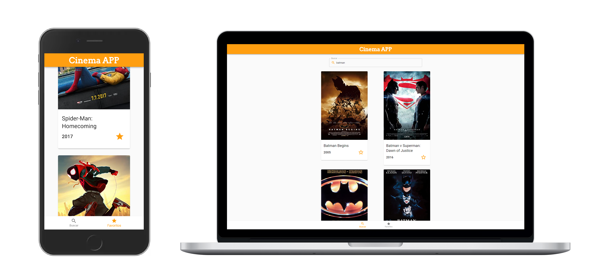

# Cinema APP
Cinema app has the objective to help people to choose the movies they like.

I created this project to test my skills, using these technologies: React and Material UI. Applying mobile first concept and aiming in a clean design.

The project use the OMDb API to get the movies and series. So you need to get an api key [here](http://www.omdbapi.com/apikey.aspx) and set as enviroment variable with the name: REACT_APP_API_KEY.

You can access the final result [here](https://guilherme.edinger.com.br/cinema-app/).

  

## How to code
### After you clone the project you need to run:
#### `npm install` or 
#### `yarn` 
to install the dependencies.

### To start the project you need to run: 
#### `npm run start` or 
#### `yarn start` 
Dont forget to set the REACT_APP_API_KEY env variable before.
